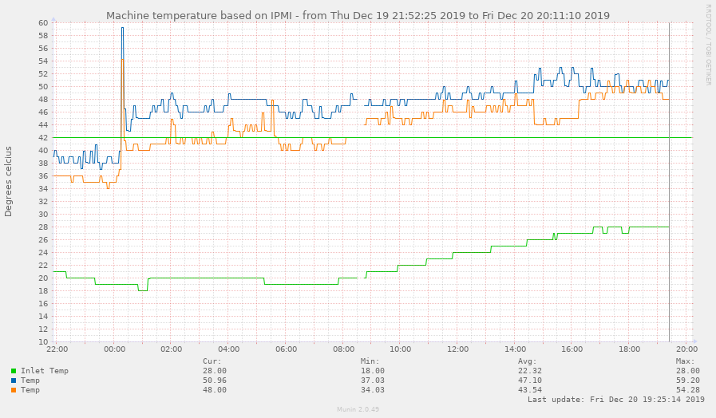
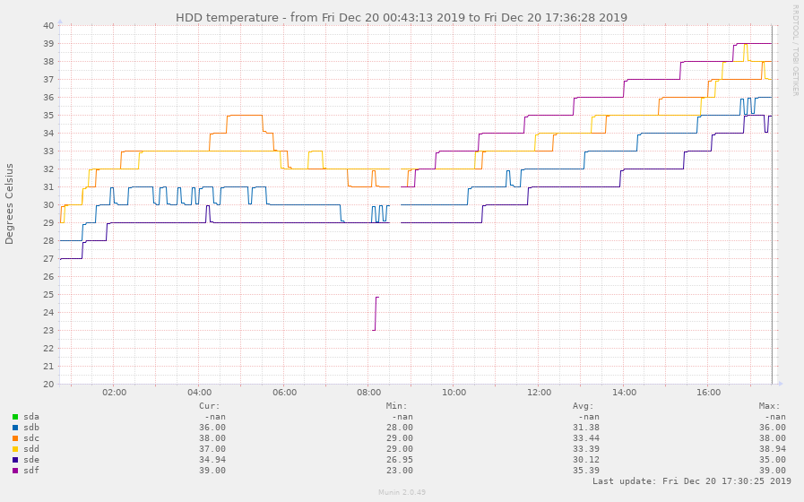
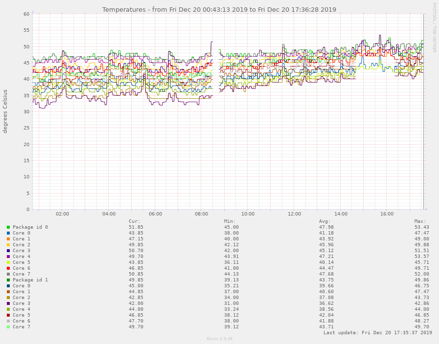
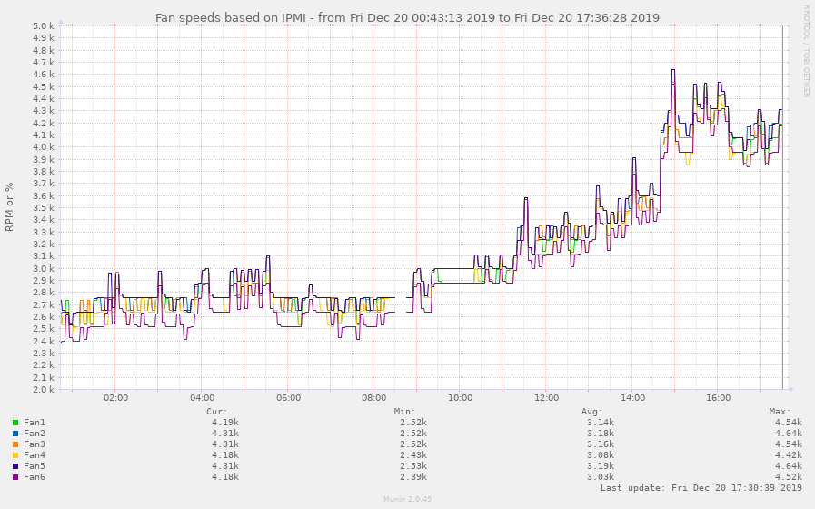

# fan speed controller for dell R710, R520 etc

Dells don't like having third party cards installed, and defaults to
ramping up the fan speed to "jetliner taking off" mode when third
party cards or non-Dell disks are added in.  But you can override
this, servoing the fans to follow the temperature demand of the
various components (disks via hddtemp, CPUs and GPUs via sensors,
ambient temperature via ipmitool).

This repo is forked from NoLooseEnds/Scripts, which contained
R710-IPMI-TEMP.  I have extended it to work on my R520, being a bit
smarter regarding the CPU and HDD temps instead of just caring about
the ambient temperature.  It uses ipmi raw commands that seem to be
similar across a wide range of dell server generations (google
searches for `ipmitool raw 0x30 0x30 0x01 0x00` show it works for
R710, R730, R730xd, T130, and I run this on my R520.

It's got a signal handler so it defaults to default behaviour when
killed by SIGINT/SIGTERM/other bugs.

I run it on my proxmox hypervisor directly, hence not needing any ipmi
passwords.  I start and stop it through proxmox's systemd system.

I wrote it the night before Australia's hottest December day on record
(hey we like our coal fondling prime-ministers).  It seems to be
coping so far now that it has reached that predicted peak (I don't
believe it's only 26 in my un-air conditioned study).

# installation (debian/proxmox)

sudo apt install liblist-moreutils-perl hddtemp lm-sensors ipmitool

sudo cp -p fan-speed-control.pl /usr/local/bin
sudo cp -p fan-speed-control.service /etc/systemd/system/fan-speed-control.service
sudo systemctl daemon-reload
sudo systemctl --now enable fan-speed-control.service

[Reddit discussion](https://www.reddit.com/r/homelab/comments/ed6w7y)

# Possibly required modifications/tuning
For the r710, you'll probably need to modify the regexps looking for "Inlet Temp" - you might need to anchor the text since it's only using grep to filter the results.

You might want to modify setpoints and thresholds. I found it simple to test by starting up a whole bunch of busy loops on each of the 32 cores in my machine, heating each core up to 60degC and making sure the fans ramped up high.

This script monitors the ambient air temperature (you will likely
need to modify the $ipmi_inlet_sensorname variable to find the correct
sensor), the hdd temperatures, the core and socket temperatures
(weighted so one core shooting up if all the others are still cold -
let the heatsink do its job).

It uses setpoints and temperature ranges you can tune to your heart's
content.  I use it to keep the fans low but increasing to a soft
volume up to 40 degrees, ramp it up quickly to 50degrees, then very
quickly towards full speed much beyond that.  It also has an ambient
air temperature threshold of 32degrees where it gives up and delegates
control back to the firmware.  Don't run your bedroom IT closet at 32
degrees yeah?

# Results

*****

# Howto: Manually setting the fan speed of the Dell R610/R710

1. Enable IPMI in iDrac
2. Install ipmitool on linux, win or mac os
3. Run the following command to issue IPMI commands: 
`ipmitool -I lanplus -H <iDracip> -U root -P <rootpw> <command>`

**Enable manual/static fan speed:**

`raw 0x30 0x30 0x01 0x00`

**Set fan speed:**

(Use i.e http://www.hexadecimaldictionary.com/hexadecimal/0x14/ to calculate speed from decimal to hex)

*3000 RPM*: `raw 0x30 0x30 0x02 0xff 0x10`

*2160 RPM*: `raw 0x30 0x30 0x02 0xff 0x0a`

*1560 RPM*: `raw 0x30 0x30 0x02 0xff 0x09`

_Note: The RPM may differ from model to model_

**Disable / Return to automatic fan control:**

`raw 0x30 0x30 0x01 0x01`

**Other: List all output from IPMI**

`sdr elist all`

**Example of a command:**

`ipmitool -I lanplus -H 192.168.0.120 -U root -P calvin  raw 0x30 0x30 0x02 0xff 0x10`

*****

**Disclaimer**

TLDR; I take _NO_ responsibility if you mess up anything.

*****

All of this was inspired by [this Reddit post](https://www.reddit.com/r/homelab/comments/72qust/r510_noise/dnkofsv/) by /u/whitekidney 
