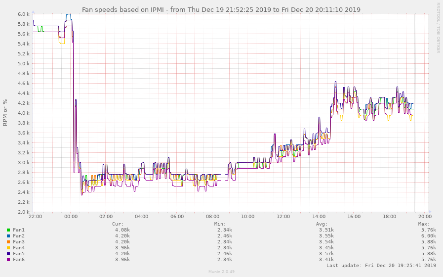

# fan speed controller for Dell Poweredge R710, R520, R730xd etc

Dells don't like having third party cards installed, and defaults to
ramping up the fan speed to "jetliner taking off" mode when some third
party cards or non-Dell disks are added in.  You can override this in
the BIOS with various settings, and iDrac8 is better than it used to
be.  But for more flexibility or if you've added a particularly hot
10gbe card and want to cool it more effectively, you can override all
of this with this repo.  Here, we servo the fans to follow the
temperature demand of the various components (disks via hddtemp, CPUs
and GPUs via sensors, ambient temperature via ipmitool).  Tuning is
alas done entirely by you modifying variable of devices to monitor in
code, alas.

This repo is forked from
[NoLooseEnds/Scripts](https://github.com/NoLooseEnds/Scripts),
which contained R710-IPMI-TEMP.  I have extended it to work on both my
R520 and R730xd (unchanged on the latter despite hardware raid card,
GPU etc), being a bit smarter regarding the CPU and HDD temps instead
of just caring about the ambient temperature.  It uses ipmi raw
commands that seem to be similar across a wide range of dell server
generations (google searches for `ipmitool raw 0x30 0x30 0x01 0x00`
show it works for R710, R730, R730xd, T130, and I run this on my R520
and R730xd).

It's got a signal handler so it defaults to default behaviour when
killed by SIGINT/SIGTERM/other bugs.

I run it on my proxmox hypervisor directly, hence not needing any ipmi
passwords.  I start and stop it through proxmox's systemd system.

I wrote it the night before Australia's hottest December day on record
(hey we like our coal fondling prime-ministers).  It seems to be
coping so far now that it has reached that predicted peak (I don't
believe it's only 26 in my un-air conditioned study).

# installation (debian/proxmox)

It's in my [ansible
module](https://github.com/spacelama/ansible-initial-server-setup/tree/master/roles/dell_server)
(which you won't want to use in full, but you can certainly adapt),
but manual installation is:

```
sudo apt install liblist-moreutils-perl lm-sensors ipmitool
# I also use my own hddtemp, since debian's hddtemp itself is unmaintained and can't deal with SAS drives and often spins up drives that are spun down:
sudo apt remove hddtemp

sudo cp -p poweredge-fand.pl /usr/local/bin && sudo chmod 755 /usr/local/bin/poweredge-fand.pl
sudo cp -p hddtemp /usr/local/bin && sudo chmod 755 /usr/local/bin/hddtemp
sudo cp -p poweredge-fand.service /etc/systemd/system/poweredge-fand.service
sudo systemctl daemon-reload
sudo systemctl --now enable poweredge-fand.service
```

[Reddit discussion](https://www.reddit.com/r/homelab/comments/ed6w7y)

# Possibly required modifications/tuning
The code's configuration is in the script, unfortunately.  It's also configured for my *specific* R730XD's in my specific climate with my specific drives and tolerance for noise.  This code comes with no warranty - you are expected to both tune it, and monitor for possible failures or things being too hot.  For the R710, you'll probably need to modify the regexps looking for "Inlet Temp" to whatever's your version of ambient air temperature - you might need to anchor the text since it's only using grep to filter the results.

You might want to modify setpoints and thresholds.  $demand isn't actually a percentage. That code is a mess, $static_speed_high is more or less arbitrary - the initial ramps are chosen to sort of scale from an input of 0-255 and map to 0x02 to 0x12 ($static_speed_low to $static_speed_high), which is bloody loud and fast on my machines, but are allowed to continue linearly even further all the way to 255 if necessary if the temperature ramps up to 6 million degrees.

I found it simple to test by starting up a whole bunch of busy loops on each of the 32 cores in my machine, heating each core up to 60degC and making sure the fans ramped up high:
```
>  grep processor /proc/cpuinfo | wc -l
64
> for i in `seq 1 64` ; do while : ; do : ; done & done
# arrrrrghhhh, hot, loud!
# Wait 5 minutes, monitoring as going.  Wait 30 minutes.  Take out loan for
# power company.  Cool, nothing emitted the magic smoke except my wallet.
# Better kill the jobs (has to be done from the same terminal, so
# hopefully your session hasn't crashed):
> for i in `seq 1 64` ; do kill %$i ; done
```

Monitor in another terminal with eg.,:
```
> sudo journalctl -n1000 -xfu poweredge-fand
...
Jan 03 02:58:20 pve1 poweredge-fand.pl[3648151]: --> disable dynamic fan control
Jan 03 02:58:23 pve1 poweredge-fand.pl[3648151]: demand(74.08) -> 13
Jan 03 02:58:23 pve1 poweredge-fand.pl[3648151]: --> ipmitool raw 0x30 0x30 0x02 0xff 0xc
Jan 03 02:58:26 pve1 poweredge-fand.pl[3648151]: --> ipmitool raw 0x30 0x30 0x02 0xff 0xb
Jan 03 02:58:41 pve1 poweredge-fand.pl[3648151]: --> ipmitool raw 0x30 0x30 0x02 0xff 0xe
Jan 03 02:58:44 pve1 poweredge-fand.pl[3648151]: --> ipmitool raw 0x30 0x30 0x02 0xff 0xd
Jan 03 02:59:12 pve1 poweredge-fand.pl[3648151]: --> ipmitool raw 0x30 0x30 0x02 0xff 0x10
Jan 03 02:59:15 pve1 poweredge-fand.pl[3648151]: --> ipmitool raw 0x30 0x30 0x02 0xff 0xf
Jan 03 02:59:23 pve1 poweredge-fand.pl[3648151]: cputemps=+55.0
Jan 03 02:59:23 pve1 poweredge-fand.pl[3648151]: coretemps=+52.0 ; +51.0 ; +51.0 ; +50.0
Jan 03 02:59:23 pve1 poweredge-fand.pl[3648151]: ambient_ipmitemps=23
Jan 03 02:59:23 pve1 poweredge-fand.pl[3648151]: hddtemps=31 ; 38 ; 28 ; 32 ; 30 ; 42 ; 41 ; 40 ; 44 ; 43
Jan 03 02:59:23 pve1 poweredge-fand.pl[3648151]: weighted_temp = 47.63 ; ambient_temp 23.00
Jan 03 02:59:23 pve1 poweredge-fand.pl[3648151]: --> disable dynamic fan control
...
> sensors
> sudo hddtemp /dev/sd?
```
Whatever.  Note that hddtemps and inlet (ambient air *intake*, which
measures your room temperature) temperature are polled less frequently
than coretemps, given they don't change as rapidly and are more expensive
to read.

This script monitors the ambient air temperature (you will likely
need to modify the $ipmi_inlet_sensorname variable to find the correct
sensor), the hdd temperatures, the core and socket temperatures
(weighted so one core shooting up if all the others are still cold doesn't suddenly convert your machine into an airfreighter taking off -
let the heatsink do its job).

It uses setpoints and temperature ranges you can tune to your heart's
content.  I use it to keep the fans low but increasing to a soft
volume up to 40 degrees, ramp it up quickly to 50degrees, then very
quickly towards full speed much beyond that.  It also has an ambient
air temperature threshold of 32degrees where it gives up and delegates
control back to the firmware.  The ambient temperature reading doesn't
normally affect how hard your fans have to spin, and is only used to
fallback to iDRAC mode so that your machine doesn't explode if eg., you've
had an air-conditioning failure.  Don't run your bedroom IT closet at 32
degrees yeah?

# Results




# Other references

This repo is forked from
[NoLooseEnds/Scripts](https://github.com/NoLooseEnds/Scripts/tree/master/R710-IPMI-TEMP),
extended to drive demand based on device temperature excesses.

Of course, for your Poweredge server of a different generation, with
different cards fitted, you may have more temperature sensors you may
want to monitor.  There's some additional sensors you may want to look
at via [commands documented
here](https://www.spxlabs.com/blog/2019/3/16/silence-your-dell-poweredge-server).

There are completely separate implementations as well.  Here's
someone's [docker container that fixes the speed until core
temperatures are
breached](https://github.com/tigerblue77/Dell_iDRAC_fan_controller_Docker),
or [this code which implements distinct speed levels and
hysteresis](https://github.com/nabijaczleweli/tarta-crust/blob/master/r710_fan_controller/usr/local/libexec/r710_fan_controller.sh).


*****

# Historical Howto: Fallback and manually testing setting the fan speed of the Dell R610/R710

Historical notes and stuff it's partially relying on behind the scenes, and if you have problems with the code, you may find yourself digging through this:

1. Enable IPMI in iDrac
2. Install ipmitool on linux, win or mac os
3. Run the following command to issue IPMI commands:
`ipmitool -I lanplus -H <iDracip> -U root -P <rootpw> <command>`

(we don't use lanplus though)

**Enable manual/static fan speed:**

`raw 0x30 0x30 0x01 0x00`


**Set fan speed:**

(Use i.e http://www.hexadecimaldictionary.com/hexadecimal/0x14/ to calculate speed from decimal to hex)

*3000 RPM*: `raw 0x30 0x30 0x02 0xff 0x10`

*2160 RPM*: `raw 0x30 0x30 0x02 0xff 0x0a`

*1560 RPM*: `raw 0x30 0x30 0x02 0xff 0x09`

_Note: The RPM may differ from model to model_


**Disable / Return to automatic fan control:**

`raw 0x30 0x30 0x01 0x01`


**Other: List all output from IPMI**

`sdr elist all`


**Example of a command:**

`ipmitool -I lanplus -H 192.168.0.120 -U root -P calvin  raw 0x30 0x30 0x02 0xff 0x10`


*****

**Disclaimer**

TLDR; I take _NO_ responsibility if you mess up anything.

*****

All of this was inspired by [this Reddit post](https://www.reddit.com/r/homelab/comments/72qust/r510_noise/dnkofsv/) by /u/whitekidney
